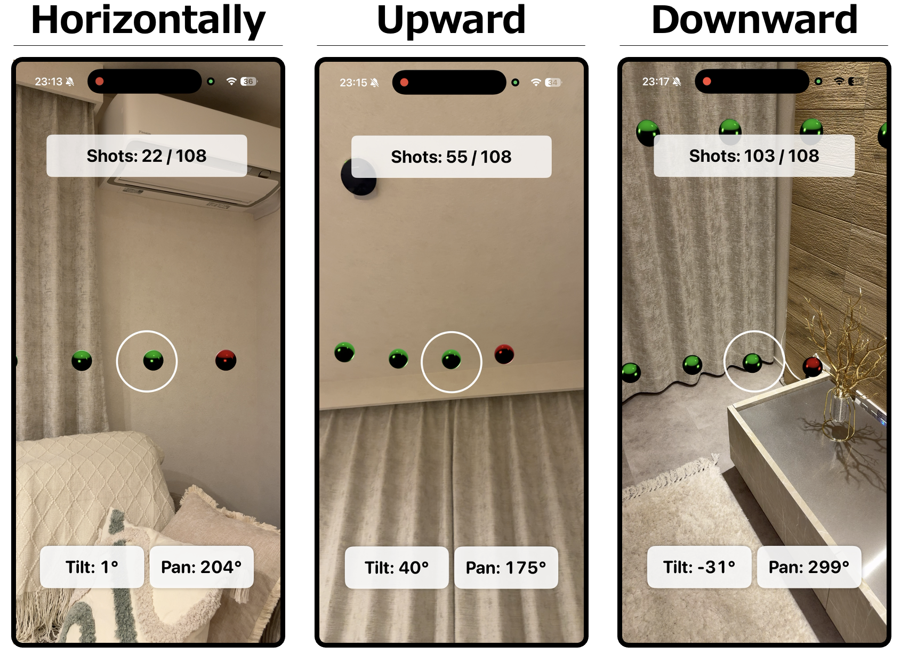

# Panoramic Depth Recorder (PDR)

## Overview
An application that uses an iPhone's LiDAR sensor and ARKit to capture RGB images, depth information, point clouds, and camera information required for 3D scene reconstruction.

## Requirements
- An iPhone equipped with a LiDAR sensor
- Xcode

## Capture Method
Adjust the device orientation according to the on-screen guide, and hold it still at the indicated capture position; the shot is taken automatically after a short pause.
Capture settings such as the number of shots per rotation, whether to include upward/downward shots, and the capture angles can be configured.

## Saved Data
The following data is saved for each shot.

- `Images`
- `DepthMaps`
- `PointCloud`
- `CameraTransform`
- `FOV`
- `TrackingStatus`

The captured data is used for 3D scene reconstruction with 3D Gaussian Splatting-based methods.

## How to Run
- Open the project in Xcode, select an iPhone equipped with a LiDAR sensor as the run target, and run.
- Since this application uses LiDAR and ARKit, it must be run on a physical device.
