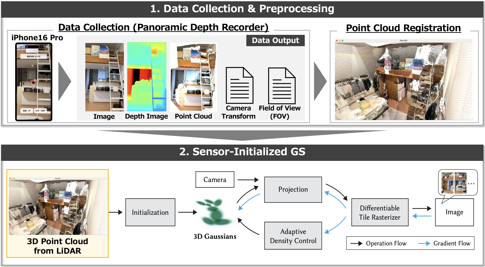
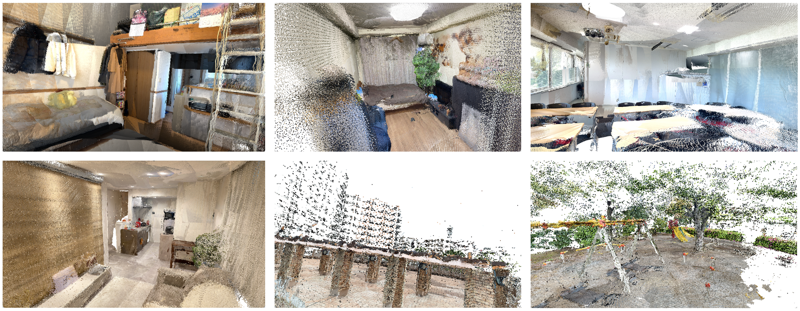
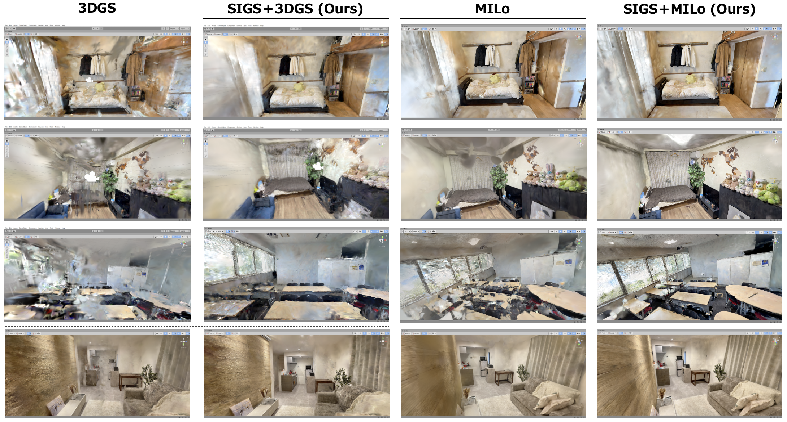
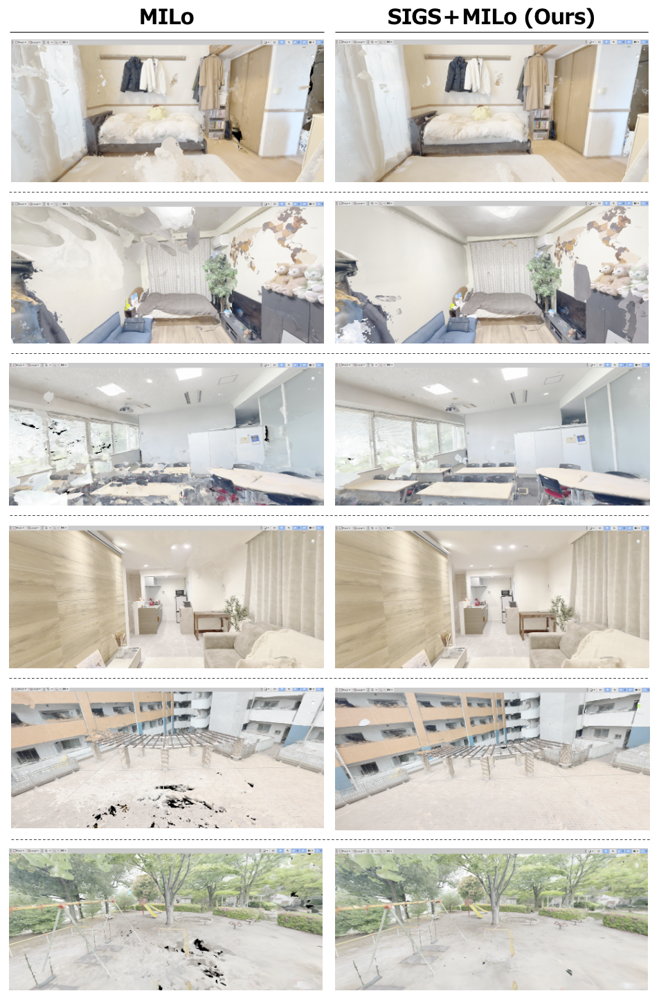
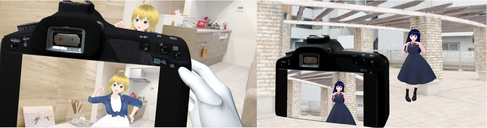

# SIGS

## Background & Purpose
- With the growing adoption of VR, there is increasing demand for technologies that reconstruct real-world environments in 3D and enable their use in virtual environments.
- 3D Gaussian Splatting (3DGS)-based methods can achieve high-quality 3D scene reconstruction. However, the SfM point clouds commonly used for initialization may be sparse or inaccurate depending on the input images and capture conditions.
- In this study, we focus on the initial point cloud used in 3DGS-based methods and leverage point clouds directly acquired with an iPhone LiDAR sensor to achieve more accurate 3D scene reconstruction and mesh generation.

## Pipeline Overview
1. Capture RGB images, LiDAR point clouds, and camera information using PDR (Panoramic Depth Recorder), a custom application developed for this study.
2. Align and merge the LiDAR point clouds captured from multiple viewpoints into a single point cloud of the entire scene.
3. Use the merged point cloud to initialize 3DGS-based methods for 3D scene reconstruction.

## Dataset
The dataset collected for this study is currently being prepared for release due to its large size. It will be released soon.

## Example Results
### Initial Point Cloud
Multiple LiDAR point clouds captured from different viewpoints are merged into a single point cloud of the entire target scene.

### 3D Scene Reconstruction
The merged point cloud is used as the initial point cloud for 3D Gaussian Splatting-based methods.
In this study, 3D scene reconstruction was performed using [3D Gaussian Splatting (3DGS)](https://github.com/graphdeco-inria/gaussian-splatting) and [MILo](https://github.com/Anttwo/MILo).

### 3D Scene Mesh
A mesh was further extracted from the reconstructed 3D scene using MILo.

### Application Example
An example of using the generated mesh in a VR environment is shown below.

